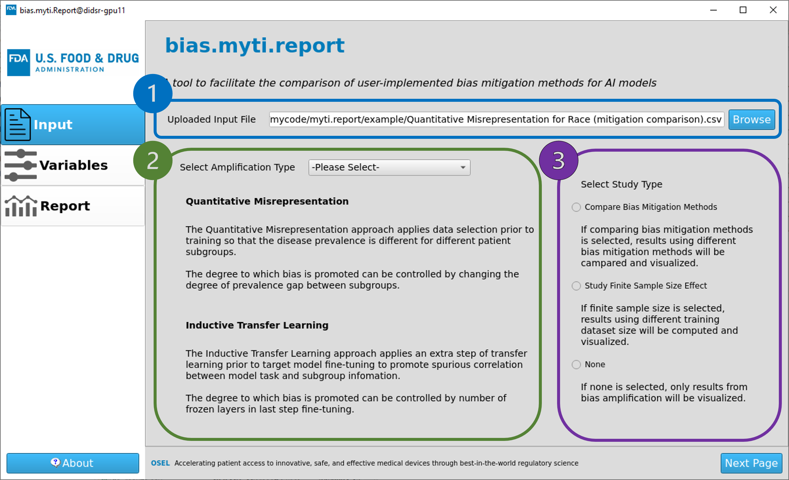

# myti.report

**Myti.report is a visualization tool to facilitate the comparison of user-implemented bias mitigation methods for AI models.**

<picture>
  <source media="(max-width: 799px)" srcset="assets/visual_abstract_vertical.png" />
  <source media="(min-width: 800px)" srcset="assets/visual_abstract_horizontal.png" />
  
</picture>

<p style="text-align: center;"> Overview of the bias amplification process  </p>

---

This repository contains the implementation of two AI bias amplification approaches presented in the paper: “Bias amplification to facilitate the systematic evaluation of bias mitigation methods”.  The graphical user interface(GUI) tool helps the user to better understand the amplified model bias with or without bias mitigation. The whole platform allows an objective assessment and systematic comparison of bias mitigation methods, and assists the user to select the most appropriate mitigation method under different circumstances.

## Related References
- A. Burgon, Y. Zhang, B. Sahiner, N. Petrick, K. H. Cha, R. K. Samala*, “Manipulation of sources of bias in AI device development”, Proc. of SPIE (2024)
- Y. Zhang, A. Burgon, N. Petrick, B. Sahiner, G. Pennello, R. K. Samala*, “Evaluation of AI bias mitigation algorithms by systematically promoting sources of bias”, RSNA Program Book (2023)

# Introduction
With increasing utilization of AI in clinical practice, it is critical to understand and control AI model bias to ensure health equities. Numerous methods have been developed to mitigate bias, however, there is a lack of consistent way to systematically evaluate the effectiveness and potential trade-off of these mitigation methods. To facilitate such evaluation, we presented two bias amplification approaches by promoting the spurious correlation between AI outputs and patient attributes.
- Quantitative misrepresentation: a manipulation of data selection to the training set such that the disease prevalence is varied between different patient subgroups.
- Inductive transfer learning: a two-step transfer learning approach where the AI is trained to classify patient attributes during the first step. The AI is then fine-tuned to perform clinical tasks during the second step.

# Getting Started

## Bias Amplification
Examples showing instructions on how to implement the two bias amplification approaches can be found in [example for quantitative misrepresention](https://github.com/DIDSR/myti.report/blob/main/example/Bias%20amplification%20(quantitative%20misrepresentation)%20example.ipynb) and [example for inductive transfer learning](https://github.com/DIDSR/myti.report/blob/main/example/Bias%20amplification%20(inductive%20transfer%20learning)%20example.ipynb).

## Quick Guide for myti.report GUI
To visualize the bias by myti.report GUI, run the following code:
```
python src/mytiUI.py
```
Here is a quick guidance on how to use the tool.
### Page 1 (Input page)
1. Select and upload the *csv* file that contains calculated bias measurements.
2. Specify the implemented bias amplification approach (quantitative misrepresentation or inductive transfer learning).
3. Select the study type (mitigation comparison, finite sample size or none of these).

Click the 'Next Page' button on bottom left after all steps are finished to navigate to the next page.



<p style="text-align: center;">  Preview of page 1 </p>

---

### Page 2 (Variables Page)
1. Click the icons to display detailed information on corresponding variables.
2. Specify corresponding column names in the *csv* file to variables.

Click the 'Next Page' button on bottom left after all steps are finished to navigate to the next page.


<p style="text-align: center;">  Preview of page 2 </p>

---

### Page 3 (Report Page)
1. Previews for bias visualization figures. Click to select the one wish to display.
2. Selected figure will be displayed along with the description below.
3. Click the "Save Report" button to save the selected figure and description.

For detailed information, view the [myti.report documentation](https://didsr.github.io/myti.report/).


<p style="text-align: center;">  Preview of page 3 </p>

---

## Example Outputs


<p style="text-align: center;">  Example figure showing bias mitigation comparison when sex-related bias has been amplified by quantitative misrepresentation. Each subplot shows the predicted disease prevalence within each patient subgroup. </p>

---

## System Requirements
```
python 3.10.12
Ubuntu 22.04.3 LTS
```
Python package requirements can be found in [requirements.txt](requirements.txt).

## Data
The imaging and associated clinical data downloaded from MIDRC (The Medical Imaging and Data Resource Center) and used for research in this repository was made possible by the National Institute of Biomedical Imaging and Bioengineering (NIBIB) of the National Institutes of Health under contract 75N92020C00021. The content is solely the responsibility of the authors and does not necessarily represent the official views of the National Institutes of Health.

